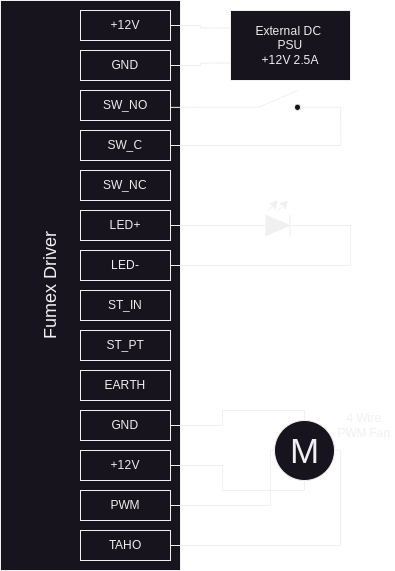
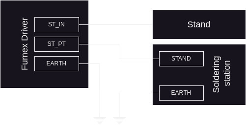

# Fumex
OpenSource fume extractor, designed for electronics laboratories

# Project repositories
[Fumex Driver](https://github.com/koszalix/fumexDriver) - Main fan controller   
[Fumex Mux](https://github.com/koszalix/fumexMux) - Additional mux, for 3 external soldering station stands   
[Fumex 858]() - *Comming soon* - Detector for Zhaoxin/WEP 858 rework station  

# Features
- PWM regulation from 5% to 95% 
- Reverse polarity and over voltage protection
- Soldering iron put down detection 
- 12V fans support 
- Up to 24W fans can be powered from the board

# Using Fumex standalone
To use Fumex standalone, just connect power supply, power switch and fan as presented at following diagram, you can 
also add power indication led if you wish (the 680R resistor is embeded on the Fumex board).

Now you can use potentiometer to regulate fan speed. Enjoy! 

# Using Fumex with soldering station 
The Fumex Driver can detect when soldering handle is putted down into stand, when such event occurs fan will be sping for about 30 seconds and then it will be switched off.   

Connection diagram is presented bellow 

# Fumex Mux, add more soldering stations 

# Sugested mechanical design
The Fumex board is designed for [Kradex Z5](https://www.kradex.com.pl/product/enclosures_with_side_panels/z5_ps?lang=en) case, also cable managments cutsouts are avaialable on boards. 
Proposed mechanical design is presented on picture bellow.

# Licensing
This project is published under the Apache-2.0 license.
